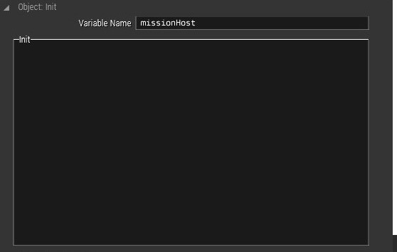

## Introduction

This is the guide to porting Krasnaya Volchitsa to your own map

## Steps

- Firstly is to add of course your player.
- Give your unit a Variable Name **missionHost**. If you have more than 1 units, choose just one to assign this variable.

- Copy all files from original Krasnaya Volchitsa **except** for mission.sqf
